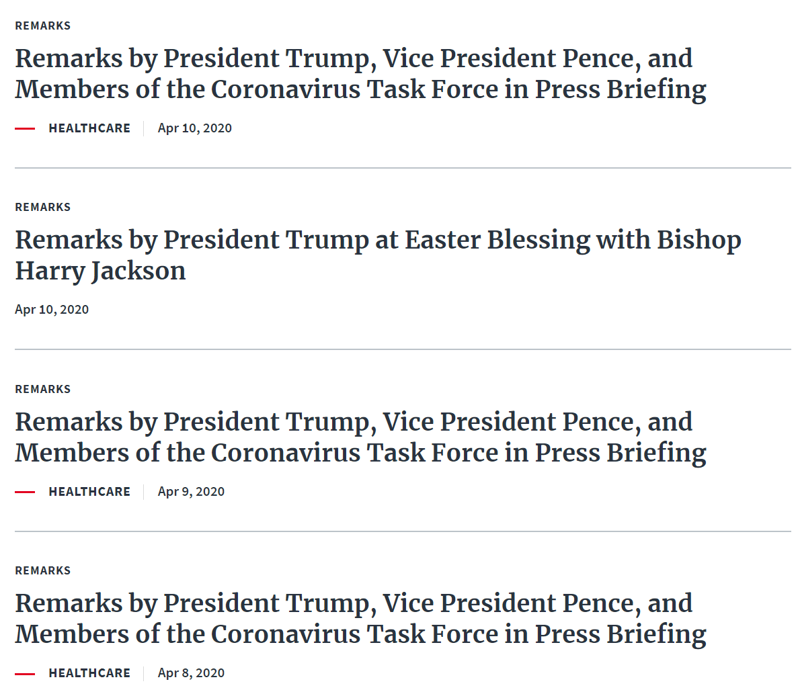

```{r setup, include=FALSE}
knitr::opts_chunk$set(echo = TRUE)
knitr::opts_chunk$set(message=FALSE)
knitr::opts_chunk$set(warning=FALSE)
library(rvest)
library(tidyverse)
library(lubridate)
```

## Web scraping information from whitehouse.gov
Web scraping is a method to extract data from websites. It is an easy way to transform the information on the web pages to a dataset. It is also inexpensive and accurate. You can get the latest information during the web scraping process. However, some websites do not allow screen scraping due to the protection policies. If I scrape too fast, some websites may identify and ban my behavior. The most common application is social media web scraping. There is no database for people's comments in social media, but through web scraping, it is easy to establish a database and analyze the data. For example, with the data, we can see people's attitude towards a policy using sentiment analysis. Another application is machine learning. Because machine learning models need a large amount of raw data to evolve. Web scraping is an efficient way to improve the reliability and accuracy of machine learning models.

I intend to get the titles, topics, and published time of all the news on the whitehouse.gov website. Manually copying and pasting information from the web pages are feasible but time-consuming, so I use the package rvest to do the web scraping. There are four kinds of news, including remarks, articles, presidential actions, and briefings and statements. I have collected all the information from January 20, 2017 to April 25, 2020.

### Web scraping remarks



The code of getting the topics is complicated. Some news do not have topics, so I have to choose a node which include both the information of time and topic. Then I can exclude the information of time and produce NAs. The process is similar in the other three kinds of news.

```{r remarks, eval=FALSE}
url<-'https://www.whitehouse.gov/remarks/page/'

remarks<-
  #get the information from all the 170 pages
  map_df(1:170,function(i) {  
  pages <- paste0(url, i, "/")
  webpage <- read_html(pages)
  
  #get the information of published time
  time_html <- html_nodes(webpage,'time')
  time <- html_text(time_html)

  #get the information of the topic
  topic_html <- html_nodes(webpage,'.meta--left')
  topic_all<- html_text(topic_html)
  
  #The nodes ".meta--left" include both the information of published time and topics, so we need to get rid of the time
  topic_split1 <- data.frame(str_split(topic_all,time))
  topic_split1 <- topic_split1[-2, ]
  topic_split1 <- as.data.frame(t(topic_split1))
  topic_list <- as.character(topic_split1[[1]])
  
  #adjust the format of the topic -- deleting some meaningless spaces here
  topic_split2 <- data.frame(str_split(topic_list,"\n\t\t\t\t\t\t\t\n\t\t\t\t\t\n\t\t\t\n\t\t\t"))
  topic_split2 <- topic_split2[-1, ]
  topic_split2 <- as.data.frame(t(topic_split2))
  topic_list <- as.character(topic_split2[[1]])
  topic_split3<- data.frame(str_split(topic_list,"\t\t\n\t\t\n\t\t\t\t\n\t\t\t\t\t\t\n\t\t\t\t"))
  topic_split3 <- topic_split3[-2, ]
  topic_split3 <- as.data.frame(t(topic_split3))
  
  #specify NAs
  topic_split3[topic_split3=="\n\t\t\t\t\t\t\n\t\t\t\t"] <- NA
  topic <- as.character(topic_split3[[1]])
  
  #get the information of the title
  title_html <-html_nodes(webpage,'.briefing-statement__title')
  title <-html_text(title_html)
  
  #combine the three columns
  data.frame(topic,time,title)
}) 

#specify that the information comes from remarks -- preparing for the combination of the four datasets later on
remarks<- mutate(remarks,type="remarks")
```

### Webscraping articles


When it comes to articles, the topics and time are not put together, so I need to choose the nodes that inlude all the information (topic, title, and time) and then get rid of titles and time in order to get topics.

```{r articles, eval=FALSE}
url<-'https://www.whitehouse.gov/articles/page/'

articles<-
  #get the information from all the 56 pages
  map_df(1:56,function(i) {
  pages <- paste0(url, i, "/")
  webpage <- read_html(pages)

  #get the information of published time
  time_html <- html_nodes(webpage,'time')
  time <- html_text(time_html)
  
  #get the information of the title
  title_html <-html_nodes(webpage,'.article__title')
  title <-html_text(title_html)

  #get the information of the topic
  results_html <- html_nodes(webpage,'.article--results')
  results <- html_text(results_html)
  
  #The nodes ".article--results" include both the information of published time, titles, and topics, so we need to get rid of the other two
  topic_split<- data.frame(str_split(results,title))
  topic_split <- topic_split[-2, ]
  topic_split <- as.data.frame(t(topic_split))
  topic_list <- as.character(topic_split[[1]])
  
  #adjust the format of the topic -- deleting some meaningless spaces here
  topic_split2 <- data.frame(str_split(topic_list,"\n\t\t\n\t\t\t\n\t\t\t"))
  topic_split2 <- topic_split2[-1, ]
  topic_split2 <- as.data.frame(t(topic_split2))
  topic_list <- as.character(topic_split2[[1]])
  topic_split3<- data.frame(str_split(topic_list,"\t\t\n\t\t\n\n\t\t"))
  topic_split3 <- topic_split3[-2, ]
  topic_split3 <- as.data.frame(t(topic_split3))
  
  #specify NAs
  topic_split3[topic_split3=="\n\t\t\n\n\t\t\t\t\t\n\t\t\n\t\t\t\n\n\t\t\t\t\t\n\t\t\n\t\t\n\t\n\n\t\n\t\n\n\t\n\t\n\t\t\n\t\t"] <- NA
  topic_split3[topic_split3=="\n\t\t\n\t\t"] <- NA
  topic <- as.character(topic_split3[[1]])

  #combine the three columns
  data.frame(topic,time,title)
})

#specify that the information comes from articles -- preparing for the combination of the four datasets later on
articles<- mutate(articles,type="articles")
```

### Webscraping presidential actions

```{r presidential_actions, eval=FALSE}
#The process is very similar to the webscraping of remarks because the websites have the same format
url<-'https://www.whitehouse.gov/presidential-actions/page/'

presidential_actions<-
  #get the information from all the 142 pages
  map_df(1:142,function(i) {
  pages <- paste0(url, i, "/")
  webpage <- read_html(pages)
  
  #get the information of published time
  time_html <- html_nodes(webpage,'time')
  time <- html_text(time_html)
  
  #get the information of the title
  title_html <-html_nodes(webpage,'.presidential-action__title')
  title <-html_text(title_html)
  
  #get the information of the topic
  topic_html <- html_nodes(webpage,'.meta--left')
  topic_all<- html_text(topic_html)
  
  #The nodes ".meta--left" include both the information of published time and topics, so we need to get rid of the time
  topic_split1 <- data.frame(str_split(topic_all,time))
  topic_split1 <- topic_split1[-2, ]
  topic_split1 <- as.data.frame(t(topic_split1))
  topic_list <- as.character(topic_split1[[1]])
  
  #adjust the format of the topic -- deleting some meaningless spaces here
  topic_split2 <- data.frame(str_split(topic_list,"\n\t\t\t\t\t\t\t\n\t\t\t\t\t\n\t\t\t\n\t\t\t"))
  topic_split2 <- topic_split2[-1, ]
  topic_split2 <- as.data.frame(t(topic_split2))
  topic_list <- as.character(topic_split2[[1]])
  topic_split3<- data.frame(str_split(topic_list,"\t\t\n\t\t\n\t\t\t\t\n\t\t\t\t\t\t\n\t\t\t\t"))
  topic_split3 <- topic_split3[-2, ]
  topic_split3 <- as.data.frame(t(topic_split3))
  
  #specify NAs
  topic_split3[topic_split3=="\n\t\t\t\t\t\t\n\t\t\t\t"] <- NA
  topic <- as.character(topic_split3[[1]])
  
  #combine the three columns
  data.frame(topic,time,title)
})

#specify that the information comes from presidential actions -- preparing for the combination of the four datasets later on
presidential_actions<- mutate(presidential_actions,type="presidential actions")
```

### Webscraping briefings & statements

```{r briefings&statements, eval=FALSE}
#The process is very similar to the webscraping of remarks because the websites have the same format
url<-'https://www.whitehouse.gov/briefings-statements/page/'

briefings_statements<-
  #get the information from all the 573 pages
  map_df(1:573,function(i) {
  pages <- paste0(url, i, "/")
  webpage <- read_html(pages)
  
  #get the information of published time
  time_html <- html_nodes(webpage,'time')
  time <- html_text(time_html)
  
  #get the information of the topic
  topic_html <- html_nodes(webpage,'.meta--left')
  topic_all<- html_text(topic_html)
  
  #The nodes ".meta--left" include both the information of published time and topics, so we need to get rid of the time
  topic_split1 <- data.frame(str_split(topic_all,time))
  topic_split1 <- topic_split1[-2, ]
  topic_split1 <- as.data.frame(t(topic_split1))
  topic_list <- as.character(topic_split1[[1]])
  
  #adjust the format of the topic -- deleting some meaningless spaces here
  topic_split2 <- data.frame(str_split(topic_list,"\n\t\t\t\t\t\t\t\n\t\t\t\t\t\n\t\t\t\n\t\t\t"))
  topic_split2 <- topic_split2[-1, ]
  topic_split2 <- as.data.frame(t(topic_split2))
  topic_list <- as.character(topic_split2[[1]])
  topic_split3<- data.frame(str_split(topic_list,"\t\t\n\t\t\n\t\t\t\t\n\t\t\t\t\t\t\n\t\t\t\t"))
  topic_split3 <- topic_split3[-2, ]
  topic_split3 <- as.data.frame(t(topic_split3))
  
  #specify NAs
  topic_split3[topic_split3=="\n\t\t\t\t\t\t\n\t\t\t\t"] <- NA
  topic <- as.character(topic_split3[[1]])
  
  #get the information of the title
  title_html <-html_nodes(webpage,'.briefing-statement__title')
  title <-html_text(title_html)
  
  #combine the three columns
  data.frame(topic,time,title)
})

#specify that the information comes from briefings & statements -- preparing for the combination of the four datasets later on
briefings_statements<- mutate(briefings_statements,type="briefings statements")
```

### Combine the four datasets

```{r combine, eval=FALSE}
#combine the four datasets
all<-rbind(remarks,articles,presidential_actions,briefings_statements)
#add an id to each piece of information
all<-mutate(all,id = row_number())
#adjust the format of published time
all$time<-dmy(all$time)
#save the dataset
write.csv(all, file="C:/Users/pc/Desktop/data science/project/all.csv")
```